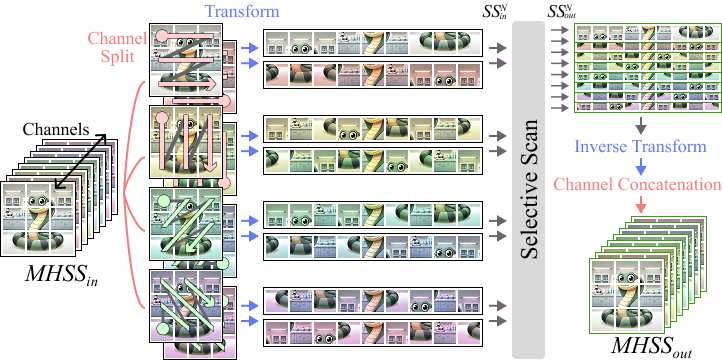

# EAMamba: Efficient All-Around Vision State Space Model for Image Restoration

[Yu-Cheng Lin](https://github.com/daidaijr), [Yu-Syuan Xu](https://github.com/XUSean0118), Hao-Wei Chen, Hsien-Kai Kuo, Chun-Yi Lee

### 🎉 Paper accepted at ICCV 2025

<!-- [](https://example.com)
[](https://example.com) -->

<!-- <hr /> -->

<hr />

> **Abstract:** *Image restoration is a key task in low-level computer vision that aims to reconstruct high-quality images from degraded inputs. The emergence of Vision Mamba, which draws inspiration from the advanced state space model Mamba, marks a significant advancement in this field. Vision Mamba demonstrates excellence in modeling long-range dependencies with linear complexity, a crucial advantage for image restoration tasks. Despite its strengths, Vision Mamba encounters challenges in low-level vision tasks, including computational complexity that scales with the number of scanning sequences and local pixel forgetting. To address these limitations, this study introduces Efficient All-Around Mamba (EAMamba), an enhanced framework that incorporates a Multi-Head Selective Scan Module (MHSSM) with an all-around scanning mechanism. MHSSM efficiently aggregates multiple scanning sequences, which avoids increases in computational complexity and parameter count. The all-around scanning strategy implements multiple patterns to capture holistic information and resolves the local pixel forgetting issue. Our experimental evaluations validate these innovations across several restoration tasks, including super resolution, denoising, deblurring, and dehazing. The results validate that EAMamba achieves a significant 31-89\% reduction in FLOPs while maintaining favorable performance compared to existing low-level Vision Mamba methods. The source codes are accessible at the following repository:* 

<br>
<hr />

## 📚 Table of Contents
- [Network Architecture](#-network-architecture)
- [Installation](#-installation)
- [Training](#-training)
- [Testing](#-testing-general)
- [Profiling](#️-profiling)
- [Task-Specific Evaluation](#-task-specific-evaluation)
- [Results](#-results)

<br>
<hr />

## 🏗️ Network Architecture
<table>
  <tr>
    <td>  </td>
  </tr>
  <tr>
    <td><p align="center"><b>Overall Framework of EAMamba</b></p></td>
  </tr>
  <tr>
    <td>  </td>
  </tr>
  <tr>
    <td><p align="center"><b>Multi-Head Selective Scan (MHSS)</b></p></td>
  </tr>
</table>

<br>
<hr />

## 💻 Installation
We use Python=3.9.12, and PyTorch>=1.13.1 with CUDA=11.7.

Installation of mamba-ssm (v2.2.2):
```bash
git clone https://github.com/state-spaces/mamba.git
cd mamba
git checkout 8ffd905
pip install .
```

Installation of required packages:
```bash
pip install -r requirements.txt
```

<br>
<hr />

## 🚂 Training
#### 📌 Training on single GPU

```bash
python3 train.py --config [MODEL_CONFIG] --name [OUTPUT_FOLDER_NAME]
```
| Parameter      | Description                        |
|----------------|------------------------------------|
| **`MODEL_CONFIG`** | Path to the model configuration file. |
| **`OUTPUT_FOLDER_NAME`** | Name of the output folder. |

<br>

#### 📌 Training on multiple GPUs

```bash
accelerate launch --config_file accelerate_[2]gpus.yaml --num_cpu_threads_per_process 32 train.py --config [MODEL_CONFIG] --name [OUTPUT_FOLDER_NAME]
```

| Parameter      | Description                        |
|----------------|------------------------------------|
| **`accelerate_[2]gpus.yaml`** | Configuration file for the number of GPUs. |
| **`MODEL_CONFIG`** | Path to the model configuration file. |
| **`OUTPUT_FOLDER_NAME`** | Name of the output folder. |

Currently we have the configuration file for 2, 4, and 8 GPUs, but you can create your own configuration file for different number of GPUs.

<br>
<hr />

## 🧪 Testing (General)
```bash
python3 test.py --model [MODEL_FILE] --dataset [DATASET] (--ensemble) (--save)
```

| Parameter      | Description                        |
|----------------|------------------------------------|
| **`MODEL_FILE`** | Path to the model file.           |
| **`DATASET`**    | Name of the dataset.              |
| **`--ensemble`** | Use ensemble mode. (Optional)    |
| **`--save`**     | Save the output images. (Optional)|

The ensemble mode is used to average the output of multiple 
rotated images to improve the performance, we did not use it in our experiments. 

<br>
<hr />

## 👁️ Profiling
#### 📌 ERF Visualization
```bash
python3 profiling/erf_viz.py --model [MODEL_FILE] (--noise)
```

| Parameter      | Description                        |
|----------------|------------------------------------|
| **`MODEL_FILE`** | Path to the model file.           |
| **`--noise`**    | Add noise to the input image. (Optional) |

Note that you need to manually change some of the variables in the erf_viz.py for different datasets, or noise levels.

<br>

#### 📌 FLOPs and Parameters Calculation
```bash
python3 profiling/flops.py --config [CONFIG_FILE] (--var) (--simple)
```

| Parameter      | Description                        |
|----------------|------------------------------------|
| **`CONFIG_FILE`** | Path to the configuration file.   |
| **`--var`**      | Calculate FLOPs and parameters for increasing input sizes until OOM. (Optional) |
| **`--simple`**   | Do not output the full model summary. (Optional) |

<br>
<hr />

## 🎯 Task-Specific Evaluation

#### 📌 Generate `.mat` Results on SIDD Dataset
Run the following command:

```bash
python3 task_evaluation/gen_sidd_mat.py --model [MODEL_FILE]
```

| Parameter      | Description                        |
|----------------|------------------------------------|
| **`MODEL_FILE`** | Path to the model file.           |

<br>

#### 📌 Generate `.png` Results on GoPro Dataset
Run the following command:

```bash
python3 task_evaluation/gen_deblur_png.py --model [MODEL_FILE] --dataset [DATASET] --input_dir [INPUT_DIR] --result_dir [RESULT_DIR]
```
| Parameter      | Description                        |
|----------------|------------------------------------|
| **`MODEL_FILE`** | Path to the model file.           |
| **`DATASET`**    | Path to the GoPro dataset.        |
| **`INPUT_DIR`**  | Path to the input images.         |
| **`RESULT_DIR`** | Path to save the results.         |

<br>
<hr />

## 📜 Results
#### 📌 Download link

[\[>> Images <<\]](https://drive.google.com/drive/folders/1UGqF2VDcnwgvhPNE5LNCsEcHRGMu7E01?usp=drive_link)
<br>

[\[>> Checkpoints <<\]](https://drive.google.com/drive/folders/1XGFUa6dvDn7D46Gpa5Q5NSBzOgjckw_v?usp=drive_link)


#### 📌 Qualitative Results
The gray scale row shows the difference between the ground truth and the generated results, with enhanced contrast for clearer visualization. Click on the dropdown to see the results for each dataset.

<details>
  <summary> <strong>📊 Real-world Super Resolution</strong></summary>
<table>
  <tr>
    <td>  </td>
  </tr>
  <tr>
    <td><p align="center"><b>RealSR dataset</b></p></td>
  </tr>
</table></details>

<details>
  <summary> <strong>📊 Real-world Denoising</strong></summary>
<table>
  <tr>
    <td>  </td>
  </tr>
  <tr>
    <td><p align="center"><b>SIDD dataset</b></p></td>
  </tr>
</table></details>

<details>
  <summary> <strong>📊 Motion Deblurring</strong></summary>
<table>
  <tr>
    <td>  </td>
  </tr>
  <tr>
    <td><p align="center"><b>GoPro dataset</b></p></td>
  </tr>
</table></details>

<details>
  <summary> <strong>📊 Synthetic Dehazing</strong></summary>
<table>
  <tr>
    <td>  </td>
  </tr>
  <tr>
    <td><p align="center"><b>SOTS-indoor dataset</b></p></td>
  </tr>
  <tr>
    <td>  </td>
  </tr>
  <tr>
    <td><p align="center"><b>SOTS-outdoor dataset</b></p></td>
  </tr>
</table></details>

<br>

#### 📌 Quantitative Results
Here are the quantitative results for each dataset. Click on the dropdown to see the results for each task.

<details>
  <summary><strong>📈 Real-world Super Resolution</strong></summary>
  <table>
    <thead>
      <tr>
        <th>Dataset</th><th>PSNR</th><th>SSIM</th>
      </tr>
    </thead>
    <tbody>
      <tr>
        <td>RealSR x2</td><td>34.18</td><td>0.927</td>
      </tr>
      <tr>
        <td>RealSR x3</td><td>31.11</td><td>0.872</td>
      </tr>
      <tr>
        <td>RealSR x4</td><td>29.60</td><td>0.835</td>
      </tr>
    </tbody>
  </table>
</details>

<details>
  <summary><strong>📈 Synthetic Gaussian Color Denoising</strong></summary>
  <table>
    <thead>
      <tr>
        <th>Dataset</th>
        <th>Sigma 15 (PSNR)</th>
        <th>Sigma 25 (PSNR)</th>
        <th>Sigma 50 (PSNR)</th>
      </tr>
    </thead>
    <tbody>
      <tr>
        <td>Urban100</td>
        <td>35.10</td>
        <td>32.93</td>
        <td>30.01</td>
      </tr>
      <tr>
        <td>CBSD68</td>
        <td>34.43</td>
        <td>31.81</td>
        <td>28.62</td>
      </tr>
      <tr>
        <td>Kodak24</td>
        <td>35.36</td>
        <td>32.95</td>
        <td>29.91</td>
      </tr>
      <tr>
        <td>McMaster</td>
        <td>35.59</td>
        <td>33.34</td>
        <td>30.31</td>
      </tr>
    </tbody>
  </table>
</details>

<details>
  <summary><strong>📈 Real-world Denoising</strong></summary>
  <table>
    <thead>
      <tr>
        <th>Dataset</th><th>PSNR</th><th>SSIM</th>
      </tr>
    </thead>
    <tbody>
      <tr>
        <td>SIDD</td><td>39.87</td><td>0.960</td>
      </tr>
    </tbody>
  </table>
</details>

<details>
  <summary><strong>📈 Motion Deblurring</strong></summary>
  <table>
    <thead>
      <tr>
        <th>Dataset</th><th>PSNR</th><th>SSIM</th>
      </tr>
    </thead>
    <tbody>
      <tr>
        <td>GoPro</td><td>33.58</td><td>0.966</td>
      </tr>
      <tr>
        <td>HIDE</td><td>31.42</td><td>0.944</td>
      </tr>
    </tbody>
  </table>
</details>

<details>
  <summary><strong>📈 Synthetic Dehazing</strong></summary>
  <table>
    <thead>
      <tr>
        <th>Dataset</th><th>PSNR</th><th>SSIM</th>
      </tr>
    </thead>
    <tbody>
      <tr>
        <td>SOTS-indoor</td><td>43.19</td><td>0.995</td>
      </tr>
      <tr>
        <td>SOTS-outdoor</td><td>36.34</td><td>0.988</td>
      </tr>
    </tbody>
  </table>
</details>

<details>
  <summary><strong>📈 Single-image Defocus Deblurring</strong></summary>
  <table>
    <thead>
      <tr>
        <th>Dataset</th><th>PSNR</th><th>SSIM</th>
      </tr>
    </thead>
    <tbody>
      <tr>
        <td>Indoor</td><td>28.90</td><td>0.887</td>
      </tr>
      <tr>
        <td>Outdoor</td><td>23.23</td><td>0.785</td>
      </tr>
      <tr>
        <td>Combined</td><td>25.99</td><td>0.821</td>
      </tr>
    </tbody>
  </table>
</details>

<hr />


<!-- ## Citation
If you use EAMamba, please consider citing:
    ...

## Contact
Should you have any question, please contact ... -->